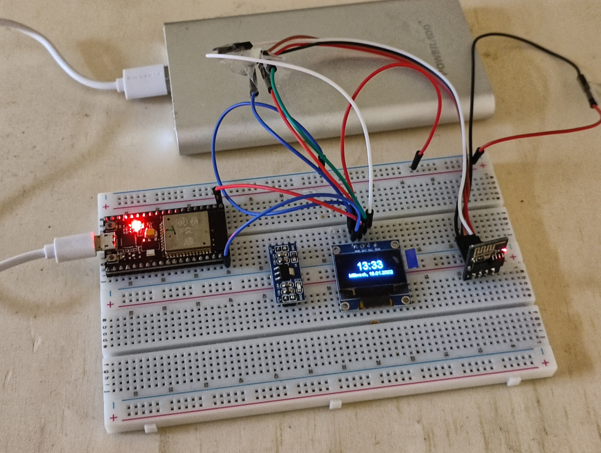

# ESP-01-NZP-Clock

Schematic and PCB: https://easyeda.com/zebrajaeger/esp-01-nzp-clock

- ESP-01 (S)
- I2C Oled Display

- The ESP32-NodeMCU module is in this case only a USB power connector
between my Powerbank and the breadboard.
- The small unconnected ADS115 PCB has no function. I forgot to remove it.

## Build

Make a copy of 

    src/config.example.h 

to 

    config.h 

and set 

- SSID
- Password
- ntp-server (if needed)
- CEST and CET (if needed)

Build & upload

## Schematic

https://easyeda.com/zebrajaeger/esp-01-nzp-clock

With 128x64 OLED pinout

- (OLED)GND to Ground
- (OLED)Vin to 3.3V

- (OLED)SDA and (ESP01)GPIO 0 together.
- (OLED)SCL and (ESP01) GPIO 2 together

 
- (ESP01)Vcc goes to 3.3V
- (ESP01)GND to GND
- (ESP01)!Reset with Resistor to 3V3
- (ESP01)PD with Resistor to 3V3
- (ESP01)TX to (PROGRAMMER)RX
- (ESP01)RX to (PROGRAMMER)TX

- (PROGRAMMER)3.3V to 3.3V
- (PROGRAMMER)GND to GND

## TODO

- [x] Real schematic
- [x] Picture of Prototype
- [x] PCB
- [ ] Picture of 'Product'
- [ ] Case
